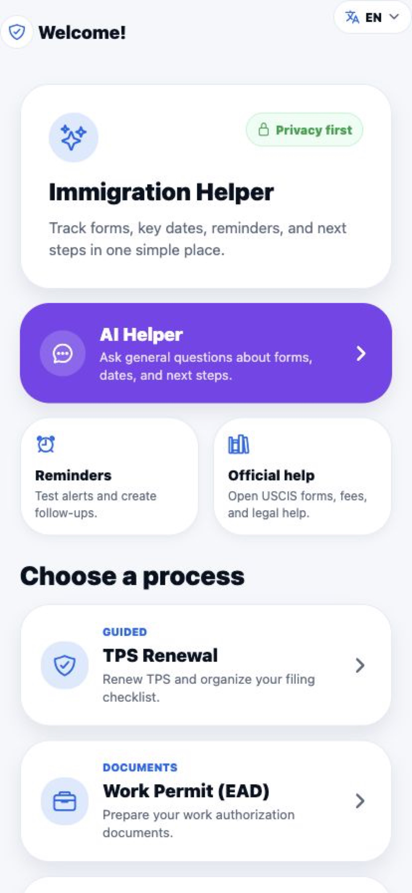
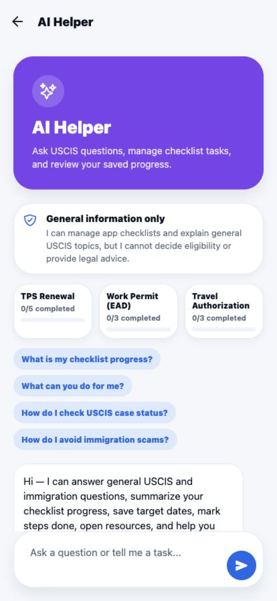
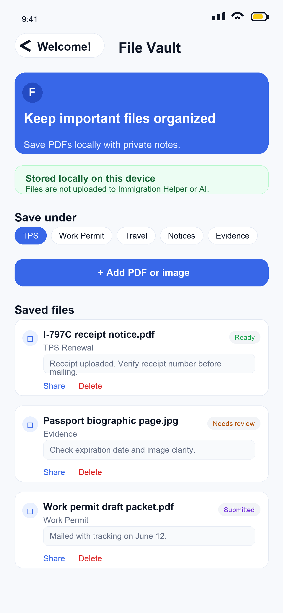

# CasePilot AI for Immigration Helper

A privacy-first, multilingual React Native product that helps people organize common U.S. immigration workflows and ask general questions grounded in official sources.

CasePilot is the in-app AI experience inside **Immigration Helper**. The product combines guided checklists, local reminders, a private on-device file vault, and official USCIS resources in one mobile-first workspace. It is built by [Deniz Izci](https://denizci.dev).

[Portfolio](https://denizci.dev) · [Support](https://kaiscout.github.io/immigration-helper/support.html) · [Privacy policy](https://kaiscout.github.io/immigration-helper/privacy-policy.html)

## Product tour

| Home and guided workflows | CasePilot AI | Private File Vault |
| --- | --- | --- |
|  |  |  |

## What the product does

- Guides users through structured checklists for TPS renewal, work authorization (EAD), and travel authorization.
- Lets users save checklist progress and target dates, then schedule local notification reminders.
- Answers general immigration questions through CasePilot with citations to official sources; it does not decide eligibility or provide legal advice.
- Grounds answers with live search restricted to official U.S. immigration agencies and a packaged corpus built from 1,951 USCIS pages and more than 14,000 searchable passages.
- Supports 30 interface languages, with localized AI routing, fallback copy, and translated workflow content.
- Keeps imported PDFs and images in the app's private on-device storage, with categories, review statuses, private notes, and explicit user-controlled sharing.
- Provides direct links to official forms, fees, case status, legal-help, and scam-prevention resources.
- Supports optional Plus subscriptions and entitlement checks through RevenueCat.

## Architecture

```text
Expo / React Native client
├── Guided flows, reminders, localization, and subscription UI
├── AsyncStorage for preferences, consent, and checklist state
└── Expo FileSystem for private local File Vault content
             │ explicit consent + HTTPS
             ▼
Node.js AI proxy on Render
├── Client-token validation, request-size controls, and rate limiting
├── Packaged USCIS corpus for local retrieval and degraded fallback
└── OpenAI Responses API with official-domain web search
```

The OpenAI API key stays on the server. The client sends online AI requests only after a first-use disclosure and consent; saved checklist context is a separate option that is off by default.

## Technology

| Layer | Tools |
| --- | --- |
| Client | React Native, Expo, React, JavaScript, TypeScript |
| Navigation and UI | React Navigation, Expo Vector Icons, React Native Reanimated |
| Local data | AsyncStorage, Expo FileSystem, Expo Document Picker, Expo Notifications |
| AI and retrieval | Node.js, OpenAI Responses API, official-domain web search, packaged USCIS corpus |
| Localization | i18next, react-i18next, 30 locale resources |
| Subscriptions | RevenueCat (`react-native-purchases`) |
| Delivery | EAS, TestFlight, Docker, Render |
| Quality | Node test runner, ESLint, Expo Doctor |

## Engineering safeguards

- Requires affirmative consent before enabling online CasePilot requests.
- Keeps optional checklist sharing disabled until the user turns it on.
- Rejects common sensitive identifier patterns before an AI request is sent.
- Stores File Vault documents locally and never uploads them to CasePilot, Render, OpenAI, RevenueCat, or a government agency.
- Keeps private OpenAI credentials out of the mobile binary and supports paired client-token checks on the proxy.
- Applies server-side request-size limits, per-client rate limiting, official-domain filtering, and source validation.
- Falls back to the packaged USCIS corpus when live AI generation is unavailable.

## Testing

The project includes **108 automated tests across 12 files**. Coverage focuses on AI grounding and citation behavior, multilingual intent routing, sensitive-data rejection, privacy consent, File Vault validation, subscription state, localized content parity, and USCIS service configuration.

Run the main checks before a build:

```bash
npm test
npm run lint
npx expo-doctor
```

## Run locally

1. Install dependencies.

   ```bash
   npm ci
   ```

2. Copy `.env.example` to `.env`. For local corpus-backed operation, set the same development token in `AI_PROXY_CLIENT_TOKEN` and `EXPO_PUBLIC_AI_CLIENT_TOKEN`. Add `OPENAI_API_KEY` only if you want live model generation; never prefix that private key with `EXPO_PUBLIC_`.

3. Start the Node service and Expo web client together.

   ```bash
   npm run web
   ```

For native development, run `npm start` and open the project with an Expo SDK 54-compatible client. Production build and store-submission notes live in [`store-submission/`](store-submission/), while backend configuration is documented in [`USCIS_AI_SETUP.md`](USCIS_AI_SETUP.md) and [`PRODUCTION_AI_DEPLOYMENT.md`](PRODUCTION_AI_DEPLOYMENT.md).

## Privacy and scope

Immigration Helper is independent and is not affiliated with USCIS, DHS, or any government agency. It provides organization tools and general information only—not legal advice, eligibility decisions, filing guarantees, or a substitute for current official instructions and qualified legal help.

Users should not submit A-Numbers, USCIS receipt numbers, passport numbers, Social Security numbers, payment details, or private legal facts to CasePilot. See the published [privacy policy](https://kaiscout.github.io/immigration-helper/privacy-policy.html) for the complete data-handling explanation.
